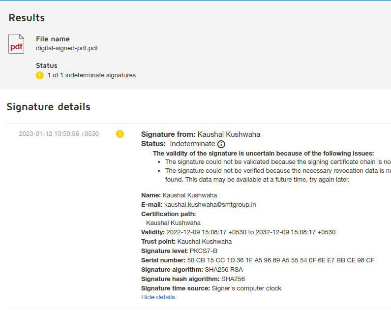

# Digital Signature In PDF Using The Library `TCPDF` in Laravel

Install TCPDF library by composer.
```
composer require elibyy/tcpdf-laravel
```

Include the service provider / facade in `config/app.php`.

```php
'providers' => [
    //...
    Elibyy\TCPDF\ServiceProvider::class,
]
//...
'aliases' => [
    //...
    'PDF' => Elibyy\TCPDF\Facades\TCPDF::class
]
```
If you want to overide TCPDF configuration, you can publish the config.

```
php artisan vendor:publish --provider="Elibyy\TCPDF\ServiceProvider"
```


Create Controller by the following command
```
php artisan make:controller TCPDFController
```
### Add new Routes

Add the following routes in `routes/web.php` file.
```php
Route::get('/tcpdf',[\App\Http\Controllers\TCPDFController::class,'downloadPdf']);
```
Add the following code in TCPDFController.
Also check certificate location variable is prefix with **'file://',** otherwise it will return error.

```php

namespace App\Http\Controllers;

use Illuminate\Http\Request;
use PDF;

class TCPDFController extends Controller
{
    public function downloadPdf(Request $request){
        //PDF::SetPrintHeader(false);
        //PDF::SetPrintFooter(false);
        $certificate = 'file://'.base_path().'/storage/app/certificate/kaushalkushwaha.crt';
            // set additional information in the signature
        $info = array(
            'Name' => 'Kaushal Kushwaha',
            'Location' => 'Indore',
            'Reason' => 'Generate Demo PDF',
            'ContactInfo' => '',
        );
        PDF::setSignature($certificate, $certificate, 'tcpdfdemo', '', 2, $info);
        PDF::SetFont('helvetica', '', 12);
        PDF::SetCreator('Kaushal Kushwaha');
        PDF::SetTitle('new-pdf');
        PDF::SetAuthor('Kaushal');
        PDF::SetSubject('Generated PDF');
        PDF::AddPage();
        $html = '<div>
            <h1>What is Lorem Ipsum?</h1>
            Lorem Ipsum is simply dummy text of the printing and typesetting industry. 
            Lorem Ipsum has been the industry`s standard dummy text ever since the 1500s,
            when an unknown printer took a galley of type and scrambled it to make a type specimen book.
            It has survived not only five centuries, but also the leap into electronic typesetting, 
            remaining essentially unchanged. It was popularised in the 1960s with the release of Letraset 
            sheets containing Lorem Ipsum passages, and more recently with desktop publishing software like 
            Aldus PageMaker including versions of Lorem Ipsum.
        </div>';
        PDF::writeHTML($html, true, false, true, false, '');
        //PDF::Image('kaushalkushwaha.png', 5, 75, 40, 15, 'PNG');
        //PDF::setSignatureAppearance(5, 75, 40, 15);
        PDF::Output(public_path('digital-signed-pdf.pdf'), 'F');
        PDF::reset();
        echo "PDF Generated Successfully";
    }
}
```
### Check Online 
We can check with online [validator.docusign.com](https://validator.docusign.com/).
<!-- <br>
 -->